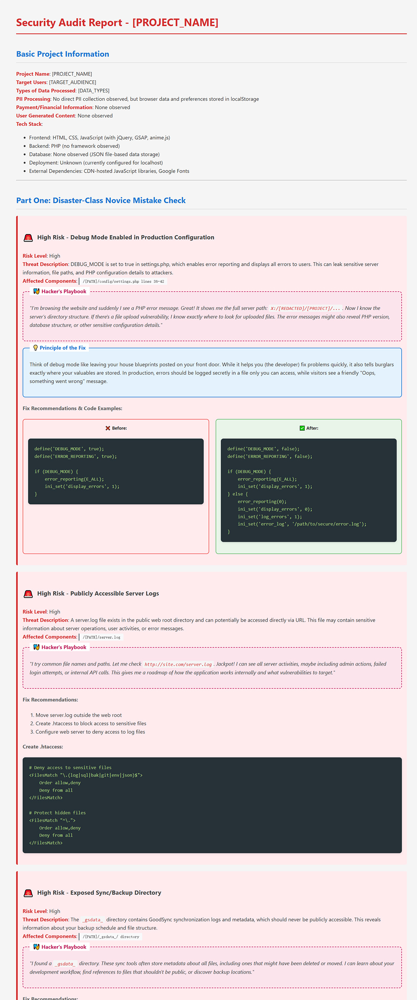

# Code Guardian Aegis (VibeCoding新手盾)

## Multi-language Support

This project provides versions in the following languages:
- **[English](#english-version)** (Current)
- **[繁體中文](#繁體中文版本)** (Traditional Chinese)
- **[簡體中文](#简体中文版本)** (Simplified Chinese)
- **[日本語](#日本語版)** (Japanese)
- **[Deutsch](#deutsch-version)** (German)
- **[Français](#version-française)** (French)
- **[Русский](#русская-версия)** (Russian)
- **[Italiano](#versione-italiana)** (Italian)
- **[한국어](#한국어-버전)** (Korean)
- **[Español](#versión-española)** (Spanish)
- **[Português](#versão-portuguesa)** (Portuguese)
- **[العربية](#النسخة-العربية)** (Arabic)
- **[Nederlands](#nederlandse-versie)** (Dutch)
- **[ไทย](#เวอร์ชันภาษาไทย)** (Thai)
- **[Tiếng Việt](#phiên-bản-tiếng-việt)** (Vietnamese)

---

## English Version

## Project Description

This project aims to prevent serious security issues that may arise when non-engineers use VibeCoding. With the widespread adoption of AI code generation tools, non-professional developers may inadvertently introduce security vulnerabilities during development due to insufficient security awareness, exposing systems to potential threats. Specifically optimized security auditing for common novice issues, providing targeted protection mechanisms.

## Project Goals

Provide comprehensive security protection mechanisms to ensure VibeCoding development projects comply with security best practices:

1. **Pre-development Prevention**: Provide security guidelines and documentation to establish security baselines during development
2. **Pre-deployment Verification**: Provide automated security audit tools for comprehensive detection of potential project risks

## File Descriptions

### Security Guidelines Documents (security-guidelines-documents/)
- **[Security-Guidelines_English.md](./security-guidelines-documents/Security-Guidelines_English.md)** - Core security development checklist for developers and AI assistants to follow during development
- **[Security-Guidelines-Explanation_English.md](./security-guidelines-documents/Security-Guidelines-Explanation_English.md)** - Detailed explanation of each security rule's importance, including hacker attack scenarios and disaster consequence analysis

### Security Audit Tools (security-audit-meta-prompt/)
- **[Security-Audit-Prompt_English.md](./security-audit-meta-prompt/Security-Audit-Prompt_English.md)** - Complete security audit instruction template for advanced AI models to conduct comprehensive project security checks

## Usage

### Pre-development Phase
1. Place security guideline files from `security-guidelines-documents/` into your VibeCoding project root directory
2. Read the security guidelines thoroughly to ensure development follows security standards
3. **Let VibeCoding Agent also read the security guidelines**: Ensure AI assistants follow security standards when generating code

### Pre-deployment Phase
1. Use audit tools from `security-audit-meta-prompt/`
2. Have advanced programming models read and audit the entire project's security
3. Fix security issues found in the audit report
4. Delete security audit reports from upload directories to prevent them from being downloaded and becoming security concerns

## Importance

- **Risk Reduction**: Minimize security vulnerabilities caused by lack of security knowledge
- **Quality Improvement**: Ensure code meets industry security standards
- **Asset Protection**: Prevent data breaches or system intrusions due to security issues
- **Compliance Requirements**: Meet enterprise or organizational security compliance needs

## Contributing

Welcome security-related improvement suggestions, new detection rules, or best practice cases. Please ensure all contributions are thoroughly security-verified.

## License and Copyright

This project content is co-created by Cyesuta and Google Gemini Pro AI.

This project is open source licensed, aiming to promote secure development practices and protect the interests of the entire developer community. Free to use, modify, and distribute, but please retain copyright notices.

---

## 繁體中文版本

[🔗 切換到英文版本](#english-version)

## 專案描述

本專案旨在防止非工程師使用 VibeCoding 時可能引發的嚴重資安問題。隨著 AI 程式碼生成工具的普及，非專業開發者在缺乏足夠資安意識的情況下進行開發，可能無意中引入安全漏洞，導致系統暴露於潛在威脅之下。特別針對新手常見問題優化安全審計，提供針對性的防護機制。

## 專案目標

提供完整的安全防護機制，確保使用 VibeCoding 開發的專案符合資安最佳實務：

1. **開發前預防**：提供安全守則與指導文件，建立開發時的安全基準
2. **上線前檢核**：提供自動化安全審計工具，全面檢測專案潛在風險

## 文件說明

### 安全守則文件 (security-guidelines-documents/)
- **[Security-Guidelines_Traditional-Chinese.md](./security-guidelines-documents/Security-Guidelines_Traditional-Chinese.md)** - 核心安全開發檢查清單，供開發者和 AI 助手在開發過程中遵循
- **[Security-Guidelines-Explanation_Traditional-Chinese.md](./security-guidelines-documents/Security-Guidelines-Explanation_Traditional-Chinese.md)** - 詳細解釋每條安全規則的重要性，包含駭客攻擊劇本和災難後果分析

### 安全審計工具 (security-audit-meta-prompt/)
- **[Security-Audit-Prompt_Traditional-Chinese.md](./security-audit-meta-prompt/Security-Audit-Prompt_Traditional-Chinese.md)** - 完整的安全審計指令模板，用於讓高級 AI 模型進行全面的專案安全檢查

## 使用方法

### 開發前階段
1. 將 `security-guidelines-documents/` 中的安全守則文件放入您的 VibeCoding 專案根目錄
2. 詳細閱讀安全守則說明，確保開發過程遵循安全規範
3. **讓 VibeCoding Agent 也讀取安全守則**：確保 AI 助手在生成程式碼時也能遵循安全規範

### 上線前階段
1. 使用 `security-audit-meta-prompt/` 中的審計工具
2. 讓高級程式設計模型讀取並審計整個專案的安全性
3. 根據審計報告修復發現的安全問題
4. 刪除上傳目錄中的安全審計報告，避免被下載而成為安全疑慮

## 重要性

- **降低風險**：減少因缺乏資安知識而產生的安全漏洞
- **提升品質**：確保程式碼符合業界安全標準
- **保護資產**：防止因安全問題造成的資料外洩或系統入侵
- **合規要求**：滿足企業或組織的資安合規需求

## 貢獻指南

歡迎提交安全相關的改進建議、新的檢測規則或最佳實務案例。請確保所有貢獻內容都經過充分的安全性驗證。

## 授權與著作權

本專案內容由 Cyesuta 與 Google Gemini Pro AI 共同創作完成。

本專案採用開源授權，旨在推廣安全開發實務，保護整個開發者社群的利益。歡迎自由使用、修改和分發，但請保留著作權聲明。

---

## 简体中文版本

[🔗 Back to Top](#code-guardian-aegis-vibecoding新手盾)

## 项目描述

本项目旨在防止非工程师使用 VibeCoding 时可能引发的严重资安问题。随着 AI 程序代码生成工具的普及，非专业开发者在缺乏足够资安意识的情况下进行开发，可能无意中引入安全漏洞，导致系统暴露于潜在威胁之下。特别针对新手常见问题优化安全审计，提供针对性的防护机制。

## 项目目标

提供完整的安全防护机制，确保使用 VibeCoding 开发的项目符合资安最佳实务：

1. **开发前预防**：提供安全守则与指导文件，建立开发时的安全基准
2. **上线前检核**：提供自动化安全审计工具，全面检测项目潜在风险

## 文件说明

### 安全守则文件 (security-guidelines-documents/)
- **[Security-Guidelines_Simplified-Chinese.md](./security-guidelines-documents/Security-Guidelines_Simplified-Chinese.md)** - 核心安全开发检查清单，供开发者和 AI 助手在开发过程中遵循
- **[Security-Guidelines-Explanation_Simplified-Chinese.md](./security-guidelines-documents/Security-Guidelines-Explanation_Simplified-Chinese.md)** - 详细解释每条安全规则的重要性，包含黑客攻击剧本和灾难后果分析

### 安全审计工具 (security-audit-meta-prompt/)
- **[Security-Audit-Prompt_Simplified-Chinese.md](./security-audit-meta-prompt/Security-Audit-Prompt_Simplified-Chinese.md)** - 完整的安全审计指令模板，用于让高级 AI 模型进行全面的项目安全检查

## 使用方法

### 开发前阶段
1. 将 `security-guidelines-documents/` 中的安全守则文件放入您的 VibeCoding 项目根目录
2. 详细阅读安全守则说明，确保开发过程遵循安全规范
3. **让 VibeCoding Agent 也读取安全守则**：确保 AI 助手在生成程序代码时也能遵循安全规范

### 上线前阶段
1. 使用 `security-audit-meta-prompt/` 中的审计工具
2. 让高级程序设计模型读取并审计整个项目的安全性
3. 根据审计报告修复发现的安全问题
4. 删除上传目录中的安全审计报告，避免被下载而成为安全疑虑

## 重要性

- **降低风险**：减少因缺乏资安知识而产生的安全漏洞
- **提升品质**：确保程序代码符合业界安全标准
- **保护资产**：防止因安全问题造成的资料外泄或系统入侵
- **合规要求**：满足企业或组织的资安合规需求

## 贡献指南

欢迎提交安全相关的改进建议、新的检测规则或最佳实务案例。请确保所有贡献内容都经过充分的安全性验证。

## 授权与著作权

本项目内容由 Cyesuta 与 Google Gemini Pro AI 共同创作完成。

本项目采用开源授权，旨在推广安全开发实务，保护整个开发者社群的利益。欢迎自由使用、修改和分发，但请保留著作权声明。

---

## 日本語版

[🔗 トップに戻る](#code-guardian-aegis-vibecoding新手盾)

## プロジェクト概要

このプロジェクトは、エンジニアではない人々がVibeCodingを利用する際に起こりうる、深刻なセキュリティ問題を防ぐことを目的としています。AIによるコード生成ツールが普及するにつれて、専門知識を持たない開発者がセキュリティ意識の不足から、意図せず脆弱性を作り込んでしまうことがあります。本プロジェクトでは、特に初心者が陥りがちな問題に焦点を当てたセキュリティ監査を提供し、的確な保護メカニズムを導入します。

## プロジェクトの目標

VibeCodingを用いた開発プロジェクトが、セキュリティのベストプラクティスに準拠するための、包括的な保護メカニズムを提供します。

1.  **開発前の予防**: セキュリティガイドラインと関連ドキュメントを提供し、開発段階でのセキュリティ基準を明確にします。
2.  **デプロイ前の検証**: 自動化されたセキュリティ監査ツールを用いて、プロジェクトに潜むリスクを網羅的に検出します。

## 各ファイルの説明

### セキュリティガイドライン関連 (security-guidelines-documents/)

-   **[Security-Guidelines_Japanese.md](./security-guidelines-documents/Security-Guidelines_Japanese.md)** - 開発者とAIアシスタントが開発プロセスで遵守すべき、中核となるセキュリティ開発チェックリストです。
-   **[Security-Guidelines-Explanation_Japanese.md](./security-guidelines-documents/Security-Guidelines-Explanation_Japanese.md)** - 各セキュリティルールの重要性について、ハッカーによる攻撃シナリオや、実際に被害が出た場合の分析を交えて詳しく解説します。

### セキュリティ監査ツール (security-audit-meta-prompt/)

-   **[Security-Audit-Prompt_Japanese.md](./security-audit-meta-prompt/Security-Audit-Prompt_Japanese.md)** - 高度なAIモデルがプロジェクト全体のセキュリティチェックを包括的に行うための、監査指示テンプレートです。

## 利用方法

### 開発前の段階

1.  `security-guidelines-documents/` 内のセキュリティガイドラインファイルを、お使いのVibeCodingプロジェクトのルートディレクトリに配置します。
2.  ガイドラインを熟読し、開発プロセスがセキュリティ基準に準拠していることを確認してください。
3.  **VibeCoding Agentにもガイドラインを読み込ませる**: AIアシスタントが生成するコードも、セキュリティ基準に従うようにします。

### デプロイ前の段階

1.  `security-audit-meta-prompt/` 内の監査ツールを使用します。
2.  高度なプログラミングモデルに、プロジェクト全体のセキュリティを読み取らせ、監査を実行させます。
3.  監査レポートで指摘されたセキュリティ上の問題を修正します。
4.  監査レポートが外部に漏れて新たなセキュリティリスクとならないよう、アップロードディレクトリから削除してください。

## このプロジェクトの重要性

-   **リスクの軽減**: セキュリティ知識の不足に起因する脆弱性を最小限に抑えます。
-   **品質の向上**: 作成されるコードが、業界のセキュリティ基準を満たすことを保証します。
-   **資産の保護**: セキュリティ問題に起因するデータ漏洩やシステムへの不正侵入を防ぎます。
-   **コンプライアンス要件への対応**: 企業や組織が求めるセキュリティコンプライアンスの要件を満たします。

## 貢献について

セキュリティに関する改善提案、新しい検出ルールの追加、ベストプラクティスの共有などを歓迎します。ご貢献いただく際には、内容が十分にセキュリティ検証されていることをご確認ください。

## ライセンスと著作権

このプロジェクトのコンテンツは、CyesutaとGoogle Gemini Pro AIの共同作業により制作されました。

安全な開発手法の普及と、開発者コミュニティ全体の利益を守ることを目指し、本プロジェクトはオープンソースライセンスを採用しています。著作権表示を保持していただければ、自由に利用、修正、配布が可能です。

---

## Deutsche Version

[🔗 Zurück zum Anfang](#code-guardian-aegis-vibecoding新手盾)

## Projektbeschreibung

Dieses Projekt soll schwerwiegende Sicherheitsprobleme verhindern, die bei der Nutzung von VibeCoding durch Laien entstehen können. Durch die zunehmende Verbreitung von KI-Tools zur Code-Erstellung können Entwickler ohne tiefgehende Sicherheitskenntnisse unbeabsichtigt Schwachstellen in ihre Projekte einbauen. Um dem entgegenzuwirken, bietet dieses Projekt gezielte Sicherheitsaudits und Schutzmechanismen, die speziell auf häufige Anfängerfehler zugeschnitten sind.

## Projektziele

Das Projekt stellt umfassende Sicherheitsmechanismen bereit, um die Einhaltung von Best Practices im Bereich der IT-Sicherheit in VibeCoding-Projekten zu gewährleisten:

1.  **Prävention in der Entwicklungsphase**: Sicherheitsrichtlinien und Dokumentationen helfen dabei, von Anfang an eine sichere Basis für die Entwicklung zu schaffen.
2.  **Überprüfung vor dem Deployment**: Automatisierte Audit-Tools ermöglichen eine umfassende Analyse des Projekts auf potenzielle Sicherheitsrisiken.

## Dateibeschreibungen

### Sicherheitsrichtlinien (security-guidelines-documents/)

-   **[Security-Guidelines_German.md](./security-guidelines-documents/Security-Guidelines_German.md)** - Eine zentrale Checkliste für die sichere Entwicklung, die von Entwicklern und KI-Assistenten während des gesamten Prozesses befolgt werden sollte.
-   **[Security-Guidelines-Explanation_German.md](./security-guidelines-documents/Security-Guidelines-Explanation_German.md)** - Eine detaillierte Erläuterung jeder Sicherheitsregel, einschließlich möglicher Angriffsszenarien und der Analyse potenzieller Schadensfolgen.

### Werkzeuge für das Sicherheitsaudit (security-audit-meta-prompt/)

-   **[Security-Audit-Prompt_German.md](./security-audit-meta-prompt/Security-Audit-Prompt_German.md)** - Eine vollständige Vorlage für Sicherheitsaudits, die von fortschrittlichen KI-Modellen genutzt werden kann, um eine umfassende Sicherheitsüberprüfung des Projekts durchzuführen.

## Anwendung

### Vor der Entwicklungsphase

1.  Kopieren Sie die Sicherheitsrichtlinien aus dem Verzeichnis `security-guidelines-documents/` in das Stammverzeichnis Ihres VibeCoding-Projekts.
2.  Lesen Sie die Richtlinien sorgfältig durch, um sicherzustellen, dass der Entwicklungsprozess den Sicherheitsstandards entspricht.
3.  **Stellen Sie sicher, dass auch der VibeCoding Agent die Richtlinien liest**: Dadurch wird gewährleistet, dass auch die KI-generierten Code-Anteile den Sicherheitsvorgaben entsprechen.

### Vor dem Deployment

1.  Nutzen Sie die Audit-Werkzeuge aus dem Verzeichnis `security-audit-meta-prompt/`.
2.  Lassen Sie ein fortschrittliches KI-Modell die Sicherheit des gesamten Projekts analysieren und bewerten.
3.  Beheben Sie alle im Audit-Bericht identifizierten Sicherheitsprobleme.
4.  Löschen Sie die Audit-Berichte aus öffentlichen Verzeichnissen, um zu verhindern, dass sie heruntergeladen werden und selbst ein Sicherheitsrisiko darstellen.

## Bedeutung

-   **Risikominimierung**: Reduziert Sicherheitslücken, die durch mangelndes Fachwissen entstehen.
-   **Qualitätssteigerung**: Stellt sicher, dass der Code den gängigen Sicherheitsstandards der Branche entspricht.
-   **Schutz von Unternehmenswerten**: Verhindert Datenlecks oder Systemeinbrüche, die auf Sicherheitsprobleme zurückzuführen sind.
-   **Einhaltung von Compliance-Vorgaben**: Hilft dabei, die Sicherheits- und Compliance-Anforderungen von Unternehmen und Organisationen zu erfüllen.

## Mitwirken

Verbesserungsvorschläge, neue Erkennungsregeln oder Beispiele für Best Practices sind jederzeit willkommen. Bitte stellen Sie sicher, dass alle Beiträge sorgfältig auf ihre Sicherheit überprüft wurden.

## Lizenz und Urheberrecht

Die Inhalte dieses Projekts wurden gemeinsam von Cyesuta und der Google Gemini Pro KI erstellt.

Dieses Projekt steht unter einer Open-Source-Lizenz, um sichere Entwicklungspraktiken zu fördern und die Interessen der gesamten Entwickler-Community zu schützen. Die Inhalte dürfen frei verwendet, verändert und weitergegeben werden, solange die Urheberrechtshinweise beibehalten werden.

---

## Version Française

[🔗 Back to Top](#code-guardian-aegis-vibecoding新手盾)

## Description du Projet

Ce projet vise à prévenir les problèmes de sécurité graves qui peuvent survenir lorsque des non-ingénieurs utilisent VibeCoding. Avec l'adoption généralisée des outils de génération de code IA, les développeurs non professionnels peuvent involontairement introduire des vulnérabilités de sécurité pendant le développement en raison d'une sensibilisation insuffisante à la sécurité, exposant les systèmes à des menaces potentielles. Audit de sécurité spécialement optimisé pour les problèmes courants des débutants, fournissant des mécanismes de protection ciblés.

## Objectifs du Projet

Fournir des mécanismes de protection de sécurité complets pour s'assurer que les projets de développement VibeCoding respectent les meilleures pratiques de sécurité :

1. **Prévention pré-développement** : Fournir des directives de sécurité et de la documentation pour établir des références de sécurité pendant le développement
2. **Vérification pré-déploiement** : Fournir des outils d'audit de sécurité automatisés pour une détection complète des risques potentiels du projet

## Description des Fichiers

### Documents des Directives de Sécurité (security-guidelines-documents/)
- **[Security-Guidelines_French.md](./security-guidelines-documents/Security-Guidelines_French.md)** - Liste de contrôle de développement sécurisé principal pour les développeurs et assistants IA à suivre pendant le processus de développement
- **[Security-Guidelines-Explanation_French.md](./security-guidelines-documents/Security-Guidelines-Explanation_French.md)** - Explication détaillée de l'importance de chaque règle de sécurité, incluant les scénarios d'attaque de hackers et l'analyse des conséquences catastrophiques

### Outils d'Audit de Sécurité (security-audit-meta-prompt/)
- **[Security-Audit-Prompt_French.md](./security-audit-meta-prompt/Security-Audit-Prompt_French.md)** - Modèle d'instructions d'audit de sécurité complet pour que les modèles IA avancés effectuent des vérifications de sécurité de projet complètes

## Utilisation

### Phase Pré-développement
1. Placez les fichiers des directives de sécurité de `security-guidelines-documents/` dans le répertoire racine de votre projet VibeCoding
2. Lisez attentivement les directives de sécurité pour vous assurer que le développement suit les normes de sécurité  
3. **Laissez aussi VibeCoding Agent lire les directives de sécurité** : Assurez-vous que les assistants IA suivent les normes de sécurité lors de la génération de code

### Phase Pré-déploiement
1. Utilisez les outils d'audit de `security-audit-meta-prompt/`
2. Faites lire et auditer la sécurité de l'ensemble du projet par des modèles de programmation avancés
3. Corrigez les problèmes de sécurité trouvés dans le rapport d'audit
4. Supprimez les rapports d'audit de sécurité des répertoires d'upload pour éviter qu'ils soient téléchargés et deviennent des préoccupations de sécurité

## Importance

- **Réduction des Risques** : Minimiser les vulnérabilités de sécurité causées par le manque de connaissances en sécurité
- **Amélioration de la Qualité** : S'assurer que le code répond aux normes de sécurité de l'industrie
- **Protection des Actifs** : Prévenir les fuites de données ou les intrusions système dues à des problèmes de sécurité
- **Exigences de Conformité** : Répondre aux exigences de conformité de sécurité d'entreprise ou d'organisation

## Guide de Contribution

Bienvenue aux suggestions d'amélioration liées à la sécurité, nouvelles règles de détection ou cas de meilleures pratiques. Veuillez vous assurer que toutes les contributions sont soigneusement vérifiées en matière de sécurité.

## Licence et Droits d'Auteur

Le contenu de ce projet a été co-créé par Cyesuta et Google Gemini Pro IA.

Ce projet est sous licence open source, visant à promouvoir les pratiques de développement sécurisé et à protéger les intérêts de toute la communauté des développeurs. Libre d'utiliser, modifier et distribuer, mais veuillez conserver les mentions de droits d'auteur.

---

## Русская Версия

[🔗 Back to Top](#code-guardian-aegis-vibecoding新手盾)

## Описание Проекта

Этот проект направлен на предотвращение серьезных проблем безопасности, которые могут возникнуть при использовании VibeCoding неинженерами. С широким распространением инструментов генерации кода ИИ, непрофессиональные разработчики могут непреднамеренно внести уязвимости безопасности во время разработки из-за недостаточной осведомленности о безопасности, подвергая системы потенциальным угрозам. Специально оптимизированный аудит безопасности для общих проблем новичков, предоставляющий целевые механизмы защиты.

## Цели Проекта

Предоставить комплексные механизмы защиты безопасности для обеспечения соответствия проектов разработки VibeCoding лучшим практикам безопасности:

1. **Предотвращение перед разработкой**: Предоставление руководства по безопасности и документации для установления базовых линий безопасности во время разработки
2. **Проверка перед развертыванием**: Предоставление автоматизированных инструментов аудита безопасности для комплексного обнаружения потенциальных рисков проекта

## Описания Файлов

### Документы Руководства по Безопасности (security-guidelines-documents/)
- **[Security-Guidelines_Russian.md](./security-guidelines-documents/Security-Guidelines_Russian.md)** - Основной контрольный список безопасной разработки для разработчиков и ИИ-помощников для следования в процессе разработки
- **[Security-Guidelines-Explanation_Russian.md](./security-guidelines-documents/Security-Guidelines-Explanation_Russian.md)** - Подробное объяснение важности каждого правила безопасности, включая сценарии хакерских атак и анализ катастрофических последствий

### Инструменты Аудита Безопасности (security-audit-meta-prompt/)
- **[Security-Audit-Prompt_Russian.md](./security-audit-meta-prompt/Security-Audit-Prompt_Russian.md)** - Полный шаблон инструкций аудита безопасности для продвинутых ИИ-моделей для проведения комплексных проверок безопасности проекта

## Использование

### Фаза Перед Разработкой
1. Поместите файлы руководства по безопасности из `security-guidelines-documents/` в корневой каталог вашего проекта VibeCoding
2. Внимательно прочитайте руководство по безопасности, чтобы убедиться, что разработка следует стандартам безопасности
3. **Пусть VibeCoding Agent также прочитает руководство по безопасности**: Убедитесь, что ИИ-помощники следуют стандартам безопасности при генерации кода

### Фаза Перед Развертыванием
1. Используйте инструменты аудита из `security-audit-meta-prompt/`
2. Пусть продвинутые модели программирования прочитают и проведут аудит безопасности всего проекта
3. Исправьте проблемы безопасности, найденные в отчете аудита
4. Удалите отчеты аудита безопасности из каталогов загрузки, чтобы предотвратить их скачивание и превращение в проблемы безопасности

## Важность

- **Снижение Рисков**: Минимизация уязвимостей безопасности, вызванных недостатком знаний о безопасности
- **Улучшение Качества**: Обеспечение соответствия кода отраслевым стандартам безопасности
- **Защита Активов**: Предотвращение утечек данных или системных вторжений из-за проблем безопасности
- **Требования Соответствия**: Соответствие требованиям безопасности предприятий или организаций

## Руководство по Вкладу

Добро пожаловать предложения улучшений, связанных с безопасностью, новые правила обнаружения или примеры лучших практик. Пожалуйста, убедитесь, что все материалы вклада тщательно проверены на безопасность.

## Лицензия и Авторские Права

Содержание этого проекта было совместно создано Cyesuta и Google Gemini Pro ИИ.

Этот проект использует лицензию с открытым исходным кодом, направленную на продвижение безопасных практик разработки и защиту интересов всего сообщества разработчиков. Свободно использовать, изменять и распространять, но пожалуйста, сохраните уведомления об авторских правах.

---

## Versione Italiana

[🔗 Torna all'inizio](#code-guardian-aegis-vibecoding新手盾)

## Descrizione del Progetto

Questo progetto mira a prevenire i gravi problemi di sicurezza che possono sorgere quando persone senza competenze ingegneristiche utilizzano VibeCoding. Con la crescente adozione di strumenti di IA per la generazione di codice, gli sviluppatori non professionisti possono, involontariamente, introdurre vulnerabilità di sicurezza a causa di una scarsa consapevolezza del problema, esponendo i sistemi a potenziali minacce. Il progetto offre un audit di sicurezza ottimizzato specificamente per i problemi più comuni tra i principianti, fornendo meccanismi di protezione mirati.

## Obiettivi del Progetto

Fornire meccanismi di sicurezza completi per garantire che i progetti sviluppati con VibeCoding siano conformi alle migliori pratiche di sicurezza:

1.  **Prevenzione prima dello sviluppo**: Offrire linee guida e documentazione di sicurezza per stabilire una solida base fin dall'inizio.
2.  **Verifica prima della distribuzione**: Mettere a disposizione strumenti di audit di sicurezza automatizzati per un rilevamento completo dei rischi potenziali del progetto.

## Descrizione dei File

### Documenti delle Linee Guida di Sicurezza (security-guidelines-documents/)

-   **[Security-Guidelines_Italian.md](./security-guidelines-documents/Security-Guidelines_Italian.md)** - Una lista di controllo centrale per lo sviluppo sicuro, da seguire sia per gli sviluppatori che per gli assistenti IA.
-   **[Security-Guidelines-Explanation_Italian.md](./security-guidelines-documents/Security-Guidelines-Explanation_Italian.md)** - Una spiegazione dettagliata dell'importanza di ogni regola di sicurezza, che include scenari di attacco e un'analisi delle possibili conseguenze.

### Strumenti di Audit di Sicurezza (security-audit-meta-prompt/)

-   **[Security-Audit-Prompt_Italian.md](./security-audit-meta-prompt/Security-Audit-Prompt_Italian.md)** - Un modello completo di istruzioni per consentire a un modello di IA avanzato di eseguire un audit di sicurezza completo del progetto.

## Utilizzo

### Fase di pre-sviluppo

1.  Inserisci i file delle linee guida di sicurezza dalla cartella `security-guidelines-documents/` nella directory principale del tuo progetto VibeCoding.
2.  Leggi attentamente le linee guida per assicurarti che il processo di sviluppo rispetti gli standard di sicurezza.
3.  **Assicurati che anche l'Agente VibeCoding legga le linee guida**: Ciò garantisce che anche il codice generato dall'IA aderisca agli standard di sicurezza.

### Fase di pre-distribuzione

1.  Utilizza gli strumenti di audit della cartella `security-audit-meta-prompt/`.
2.  Consenti a un modello di programmazione avanzato di leggere e verificare la sicurezza dell'intero progetto.
3.  Risolvi i problemi di sicurezza identificati nel rapporto di audit.
4.  Elimina i rapporti di audit dalle cartelle di caricamento per evitare che vengano scaricati e diventino un nuovo rischio per la sicurezza.

## Importanza

-   **Riduzione dei rischi**: Minimizza le vulnerabilità di sicurezza causate dalla mancanza di conoscenze tecniche.
-   **Miglioramento della qualità**: Assicura che il codice sia conforme agli standard di sicurezza del settore.
-   **Protezione degli asset**: Previene fughe di dati e intrusioni nel sistema dovute a problemi di sicurezza.
-   **Conformità normativa**: Aiuta a soddisfare i requisiti di sicurezza e conformità di aziende e organizzazioni.

## Contributi

Qualsiasi suggerimento di miglioramento, nuove regole di rilevamento o esempi di buone pratiche sono benvenuti. Si prega di assicurarsi che tutti i contributi siano stati accuratamente verificati dal punto di vista della sicurezza.

## Licenza e Copyright

Il contenuto di questo progetto è stato creato congiuntamente da Cyesuta e dall'IA di Google Gemini Pro.

Questo progetto è distribuito con una licenza open source con l'obiettivo di promuovere pratiche di sviluppo sicure e di proteggere gli interessi dell'intera comunità di sviluppatori. Il contenuto può essere utilizzato, modificato e distribuito liberamente, a condizione che vengano mantenute le note sul copyright.

---

## 한국어 버전

[🔗 맨 위로](#code-guardian-aegis-vibecoding新手盾)

## 프로젝트 설명

이 프로젝트는 비전문가가 VibeCoding을 사용할 때 발생할 수 있는 심각한 보안 문제를 예방하기 위해 만들어졌습니다. AI 코드 생성 도구가 널리 보급됨에 따라, 보안 지식이 부족한 개발자가 자신도 모르게 보안 취약점을 만들 수 있으며, 이는 시스템을 잠재적인 위협에 노출시킬 수 있습니다. 본 프로젝트는 특히 초보자가 흔히 겪는 문제에 최적화된 보안 감사를 제공하여, 표적화된 보호 체계를 마련합니다.

## 프로젝트 목표

VibeCoding으로 개발하는 프로젝트가 보안 모범 사례를 따르도록, 포괄적인 보안 보호 체계를 제공합니다.

1.  **개발 전 예방**: 개발 단계에서부터 보안 기준을 마련할 수 있도록 보안 가이드라인과 관련 문서를 제공합니다.
2.  **배포 전 검증**: 자동화된 보안 감사 도구를 통해 프로젝트에 잠재된 리스크를 종합적으로 탐지합니다.

## 파일 설명

### 보안 가이드라인 문서 (security-guidelines-documents/)

-   **[Security-Guidelines_Korean.md](./security-guidelines-documents/Security-Guidelines_Korean.md)** - 개발자와 AI 어시스턴트가 개발 과정 전반에 걸쳐 따라야 할 핵심 보안 개발 체크리스트입니다.
-   **[Security-Guidelines-Explanation_Korean.md](./security-guidelines-documents/Security-Guidelines-Explanation_Korean.md)** - 각 보안 규칙의 중요성을 해커의 공격 시나리오와 실제 재난 상황 분석을 포함하여 상세히 설명합니다.

### 보안 감사 도구 (security-audit-meta-prompt/)

-   **[Security-Audit-Prompt_Korean.md](./security-audit-meta-prompt/Security-Audit-Prompt_Korean.md)** - 고급 AI 모델이 프로젝트의 보안을 종합적으로 점검할 수 있도록 구성된, 완전한 형태의 보안 감사 지침 템플릿입니다.

## 사용 방법

### 개발 전 단계

1.  `security-guidelines-documents/` 폴더의 보안 가이드라인 파일을 VibeCoding 프로젝트의 최상위 폴더에 넣으십시오.
2.  개발 과정이 보안 표준을 준수할 수 있도록 가이드라인을 충분히 숙지하십시오.
3.  **VibeCoding Agent에게도 보안 가이드라인을 읽도록 하십시오**: 이를 통해 AI 어시스턴트가 생성하는 코드 또한 보안 표준을 따르도록 보장할 수 있습니다.

### 배포 전 단계

1.  `security-audit-meta-prompt/` 폴더의 감사 도구를 사용하십시오.
2.  고급 프로그래밍 모델을 통해 프로젝트 전체의 보안을 읽고 감사하게 하십시오.
3.  감사 보고서에서 발견된 보안 문제를 해결하십시오.
4.  감사 보고서가 외부에 유출되어 또 다른 보안 위협이 되지 않도록, 업로드 폴더에서 관련 보고서를 삭제하십시오.

## 중요성

-   **리스크 감소**: 보안 지식 부족으로 인해 발생할 수 있는 보안 취약점을 최소화합니다.
-   **품질 향상**: 생성된 코드가 업계의 보안 표준을 충족하도록 보장합니다.
-   **자산 보호**: 보안 문제로 인한 데이터 유출이나 시스템 침해를 방지합니다.
-   **규정 준수**: 기업 및 조직에서 요구하는 보안 규정 준수 요건을 충족하는 데 도움이 됩니다.

## 기여 안내

보안 관련 개선 제안, 새로운 탐지 규칙, 모범 사례 등을 언제나 환영합니다. 모든 기여 내용은 보안 관점에서 충분히 검증되었는지 확인해 주시기 바랍니다.

## 라이선스 및 저작권

이 프로젝트의 콘텐츠는 Cyesuta와 Google Gemini Pro AI가 공동으로 제작하였습니다.

본 프로젝트는 안전한 개발 관행을 장려하고 전체 개발자 커뮤니티의 이익을 보호하기 위해 오픈 소스 라이선스를 채택하고 있습니다. 저작권 표시를 유지하는 조건 하에 자유롭게 사용, 수정, 배포할 수 있습니다.

[🔗 Back to Top](#code-guardian-aegis-vibecoding新手盾)

## 프로젝트 설명

이 프로젝트는 비엔지니어가 VibeCoding을 사용할 때 발생할 수 있는 심각한 보안 문제를 예방하는 것을 목표로 합니다. AI 코드 생성 도구의 광범위한 채택으로 인해, 비전문 개발자들이 충분한 보안 인식 없이 개발하는 동안 보안 취약점을 의도치 않게 도입할 수 있어 시스템을 잠재적 위협에 노출시킬 수 있습니다. 초보자의 일반적인 문제에 특별히 최적화된 보안 감사를 제공하여 표적화된 보호 메커니즘을 제공합니다.

## 프로젝트 목표

VibeCoding 개발 프로젝트가 보안 모범 사례를 준수하도록 보장하는 포괄적인 보안 보호 메커니즘 제공:

1. **개발 전 예방**: 개발 중 보안 기준선을 설정하기 위한 보안 가이드라인과 문서 제공
2. **배포 전 검증**: 프로젝트의 잠재적 위험을 포괄적으로 탐지하기 위한 자동화된 보안 감사 도구 제공

## 파일 설명

### 보안 가이드라인 문서 (security-guidelines-documents/)
- **[Security-Guidelines_Korean.md](./security-guidelines-documents/Security-Guidelines_Korean.md)** - 개발자와 AI 어시스턴트가 개발 과정에서 따라야 할 핵심 보안 개발 체크리스트
- **[Security-Guidelines-Explanation_Korean.md](./security-guidelines-documents/Security-Guidelines-Explanation_Korean.md)** - 해커 공격 시나리오와 재앙적 결과 분석을 포함한 각 보안 규칙의 중요성에 대한 자세한 설명

### 보안 감사 도구 (security-audit-meta-prompt/)
- **[Security-Audit-Prompt_Korean.md](./security-audit-meta-prompt/Security-Audit-Prompt_Korean.md)** - 고급 AI 모델이 포괄적인 프로젝트 보안 검사를 수행할 수 있는 완전한 보안 감사 지침 템플릿

## 사용법

### 개발 전 단계
1. `security-guidelines-documents/`의 보안 가이드라인 파일을 VibeCoding 프로젝트 루트 디렉터리에 배치
2. 개발이 보안 표준을 따르도록 보안 가이드라인을 주의 깊게 읽기
3. **VibeCoding Agent도 보안 가이드라인을 읽도록 하기**: AI 어시스턴트가 코드 생성 시 보안 표준을 따르도록 보장

### 배포 전 단계
1. `security-audit-meta-prompt/`의 감사 도구 사용
2. 고급 프로그래밍 모델이 전체 프로젝트의 보안을 읽고 감사하도록 하기
3. 감사 보고서에서 발견된 보안 문제 수정
4. 업로드 디렉터리에서 보안 감사 보고서를 삭제하여 다운로드되어 보안 우려가 되는 것을 방지

## 중요성

- **위험 감소**: 보안 지식 부족으로 인한 보안 취약점 최소화
- **품질 향상**: 코드가 업계 보안 표준을 충족하도록 보장
- **자산 보호**: 보안 문제로 인한 데이터 유출이나 시스템 침입 방지
- **규정 준수 요구사항**: 기업이나 조직의 보안 규정 준수 요구사항 충족

## 기여 가이드

보안 관련 개선 제안, 새로운 탐지 규칙 또는 모범 사례 사례를 환영합니다. 모든 기여가 보안에 대해 철저히 검증되었는지 확인해 주세요.

## 라이선스 및 저작권

이 프로젝트의 내용은 Cyesuta와 Google Gemini Pro AI가 공동 제작했습니다.

이 프로젝트는 안전한 개발 관행을 촉진하고 전체 개발자 커뮤니티의 이익을 보호하는 것을 목표로 하는 오픈 소스 라이선스를 사용합니다. 자유롭게 사용, 수정, 배포할 수 있지만 저작권 고지를 유지해 주세요.

---

## Versión Española

[🔗 Back to Top](#code-guardian-aegis-vibecoding新手盾)

## Descripción del Proyecto

Este proyecto tiene como objetivo prevenir problemas graves de seguridad que pueden surgir cuando no-ingenieros utilizan VibeCoding. Con la adopción generalizada de herramientas de generación de código IA, desarrolladores no profesionales pueden introducir inadvertidamente vulnerabilidades de seguridad durante el desarrollo debido a una conciencia de seguridad insuficiente, exponiendo los sistemas a amenazas potenciales. Auditoría de seguridad específicamente optimizada para problemas comunes de principiantes, proporcionando mecanismos de protección dirigidos.

## Objetivos del Proyecto

Proporcionar mecanismos completos de protección de seguridad para asegurar que los proyectos de desarrollo VibeCoding cumplan con las mejores prácticas de seguridad:

1. **Prevención pre-desarrollo**: Proporcionar directrices de seguridad y documentación para establecer líneas base de seguridad durante el desarrollo
2. **Verificación pre-despliegue**: Proporcionar herramientas automatizadas de auditoría de seguridad para la detección integral de riesgos potenciales del proyecto

## Descripciones de Archivos

### Documentos de Directrices de Seguridad (security-guidelines-documents/)
- **[Security-Guidelines_Spanish.md](./security-guidelines-documents/Security-Guidelines_Spanish.md)** - Lista de verificación principal de desarrollo seguro para desarrolladores y asistentes IA a seguir durante el proceso de desarrollo
- **[Security-Guidelines-Explanation_Spanish.md](./security-guidelines-documents/Security-Guidelines-Explanation_Spanish.md)** - Explicación detallada de la importancia de cada regla de seguridad, incluyendo escenarios de ataque de hackers y análisis de consecuencias catastróficas

### Herramientas de Auditoría de Seguridad (security-audit-meta-prompt/)
- **[Security-Audit-Prompt_Spanish.md](./security-audit-meta-prompt/Security-Audit-Prompt_Spanish.md)** - Plantilla completa de instrucciones de auditoría de seguridad para que modelos IA avanzados realicen verificaciones de seguridad de proyecto integrales

## Uso

### Fase Pre-desarrollo
1. Coloca los archivos de directrices de seguridad de `security-guidelines-documents/` en el directorio raíz de tu proyecto VibeCoding
2. Lee cuidadosamente las directrices de seguridad para asegurar que el desarrollo siga los estándares de seguridad
3. **Deja que VibeCoding Agent también lea las directrices de seguridad**: Asegura que los asistentes IA sigan los estándares de seguridad al generar código

### Fase Pre-despliegue
1. Usa herramientas de auditoría de `security-audit-meta-prompt/`
2. Deja que modelos de programación avanzados lean y auditen la seguridad de todo el proyecto
3. Corrige problemas de seguridad encontrados en el reporte de auditoría
4. Elimina reportes de auditoría de seguridad de los directorios de subida para evitar que sean descargados y se conviertan en preocupaciones de seguridad

## Importancia

- **Reducción de Riesgos**: Minimizar vulnerabilidades de seguridad causadas por falta de conocimiento de seguridad
- **Mejora de Calidad**: Asegurar que el código cumpla con estándares de seguridad de la industria
- **Protección de Activos**: Prevenir fugas de datos o intrusiones del sistema debido a problemas de seguridad
- **Requisitos de Cumplimiento**: Cumplir con requisitos de cumplimiento de seguridad empresariales u organizacionales

## Guía de Contribución

Bienvenidas sugerencias de mejora relacionadas con seguridad, nuevas reglas de detección o casos de mejores prácticas. Por favor asegúrate de que todas las contribuciones estén minuciosamente verificadas en cuanto a seguridad.

## Licencia y Derechos de Autor

El contenido de este proyecto ha sido co-creado por Cyesuta y Google Gemini Pro IA.

Este proyecto utiliza licencia de código abierto, dirigida a promover prácticas de desarrollo seguro y proteger los intereses de toda la comunidad de desarrolladores. Libre de usar, modificar y distribuir, pero por favor mantén los avisos de derechos de autor.

---

## Versão Portuguesa

[🔗 Back to Top](#code-guardian-aegis-vibecoding新手盾)

## Descrição do Projeto

Este projeto visa prevenir problemas graves de segurança que podem surgir quando não-engenheiros usam VibeCoding. Com a adoção generalizada de ferramentas de geração de código IA, desenvolvedores não profissionais podem inadvertidamente introduzir vulnerabilidades de segurança durante o desenvolvimento devido à consciência de segurança insuficiente, expondo sistemas a ameaças potenciais. Auditoria de segurança especificamente otimizada para problemas comuns de iniciantes, fornecendo mecanismos de proteção direcionados.

## Objetivos do Projeto

Fornecer mecanismos abrangentes de proteção de segurança para garantir que projetos de desenvolvimento VibeCoding atendam às melhores práticas de segurança:

1. **Prevenção pré-desenvolvimento**: Fornecer diretrizes de segurança e documentação para estabelecer linhas de base de segurança durante o desenvolvimento
2. **Verificação pré-implantação**: Fornecer ferramentas automatizadas de auditoria de segurança para detecção abrangente de riscos potenciais do projeto

## Descrições de Arquivos

### Documentos de Diretrizes de Segurança (security-guidelines-documents/)
- **[Security-Guidelines_Portuguese.md](./security-guidelines-documents/Security-Guidelines_Portuguese.md)** - Lista de verificação principal de desenvolvimento seguro para desenvolvedores e assistentes IA seguirem durante o processo de desenvolvimento
- **[Security-Guidelines-Explanation_Portuguese.md](./security-guidelines-documents/Security-Guidelines-Explanation_Portuguese.md)** - Explicação detalhada da importância de cada regra de segurança, incluindo cenários de ataque de hackers e análise de consequências catastróficas

### Ferramentas de Auditoria de Segurança (security-audit-meta-prompt/)
- **[Security-Audit-Prompt_Portuguese.md](./security-audit-meta-prompt/Security-Audit-Prompt_Portuguese.md)** - Template completo de instruções de auditoria de segurança para modelos IA avançados conduzirem verificações de segurança de projeto abrangentes

## Uso

### Fase Pré-desenvolvimento
1. Coloque os arquivos de diretrizes de segurança de `security-guidelines-documents/` no diretório raiz do seu projeto VibeCoding
2. Leia cuidadosamente as diretrizes de segurança para garantir que o desenvolvimento siga os padrões de segurança
3. **Deixe o VibeCoding Agent também ler as diretrizes de segurança**: Garanta que assistentes IA sigam padrões de segurança ao gerar código

### Fase Pré-implantação
1. Use ferramentas de auditoria de `security-audit-meta-prompt/`
2. Deixe modelos de programação avançados lerem e auditarem a segurança de todo o projeto
3. Corrija problemas de segurança encontrados no relatório de auditoria
4. Exclua relatórios de auditoria de segurança dos diretórios de upload para evitar que sejam baixados e se tornem preocupações de segurança

## Importância

- **Redução de Riscos**: Minimizar vulnerabilidades de segurança causadas pela falta de conhecimento de segurança
- **Melhoria da Qualidade**: Garantir que o código atenda aos padrões de segurança da indústria
- **Proteção de Ativos**: Prevenir vazamentos de dados ou intrusões de sistema devido a problemas de segurança
- **Requisitos de Conformidade**: Atender aos requisitos de conformidade de segurança empresariais ou organizacionais

## Guia de Contribuição

Sugestões de melhoria relacionadas à segurança, novas regras de detecção ou casos de melhores práticas são bem-vindos. Por favor, certifique-se de que todas as contribuições sejam minuciosamente verificadas quanto à segurança.

## Licença e Direitos Autorais

O conteúdo deste projeto foi co-criado pela Cyesuta e Google Gemini Pro IA.

Este projeto usa licença de código aberto, visando promover práticas de desenvolvimento seguro e proteger os interesses de toda a comunidade de desenvolvedores. Livre para usar, modificar e distribuir, mas por favor mantenha os avisos de direitos autorais.

---

## النسخة العربية

[🔗 Back to Top](#code-guardian-aegis-vibecoding新手盾)

## وصف المشروع

يهدف هذا المشروع إلى منع مشاكل الأمان الخطيرة التي قد تنشأ عندما يستخدم غير المهندسين VibeCoding. مع الاعتماد الواسع لأدوات توليد الكود بالذكاء الاصطناعي، قد يقوم المطورون غير المحترفين بإدخال ثغرات أمنية عن غير قصد أثناء التطوير بسبب عدم كفاية الوعي الأمني، مما يعرض الأنظمة لتهديدات محتملة. مراجعة أمنية محسنة خصيصاً لمشاكل المبتدئين الشائعة، توفر آليات حماية مستهدفة.

## أهداف المشروع

توفير آليات حماية أمنية شاملة لضمان امتثال مشاريع تطوير VibeCoding لأفضل ممارسات الأمان:

1. **الوقاية قبل التطوير**: توفير إرشادات الأمان والوثائق لإنشاء خطوط أساس أمنية أثناء التطوير
2. **التحقق قبل النشر**: توفير أدوات مراجعة أمنية آلية للكشف الشامل عن المخاطر المحتملة للمشروع

## أوصاف الملفات

### وثائق إرشادات الأمان (security-guidelines-documents/)
- **[Security-Guidelines_Arabic.md](./security-guidelines-documents/Security-Guidelines_Arabic.md)** - قائمة مراجعة التطوير الآمن الأساسية للمطورين ومساعدي الذكاء الاصطناعي لاتباعها أثناء عملية التطوير
- **[Security-Guidelines-Explanation_Arabic.md](./security-guidelines-documents/Security-Guidelines-Explanation_Arabic.md)** - شرح مفصل لأهمية كل قاعدة أمان، بما في ذلك سيناريوهات هجمات القراصنة وتحليل العواقب الكارثية

### أدوات المراجعة الأمنية (security-audit-meta-prompt/)
- **[Security-Audit-Prompt_Arabic.md](./security-audit-meta-prompt/Security-Audit-Prompt_Arabic.md)** - قالب تعليمات مراجعة أمنية شامل لنماذج الذكاء الاصطناعي المتقدمة لإجراء فحوصات أمنية شاملة للمشروع

## الاستخدام

### مرحلة ما قبل التطوير
1. ضع ملفات إرشادات الأمان من `security-guidelines-documents/` في دليل جذر مشروع VibeCoding الخاص بك
2. اقرأ إرشادات الأمان بعناية للتأكد من أن التطوير يتبع معايير الأمان
3. **دع VibeCoding Agent يقرأ إرشادات الأمان أيضاً**: تأكد من أن مساعدي الذكاء الاصطناعي يتبعون معايير الأمان عند توليد الكود

### مرحلة ما قبل النشر
1. استخدم أدوات المراجعة من `security-audit-meta-prompt/`
2. دع نماذج البرمجة المتقدمة تقرأ وتراجع أمان المشروع بأكمله
3. أصلح مشاكل الأمان الموجودة في تقرير المراجعة
4. احذف تقارير المراجعة الأمنية من أدلة الرفع لمنع تحميلها وأن تصبح مخاوف أمنية

## الأهمية

- **تقليل المخاطر**: تقليل الثغرات الأمنية الناجمة عن نقص المعرفة الأمنية
- **تحسين الجودة**: ضمان أن الكود يلبي معايير الأمان الصناعية
- **حماية الأصول**: منع تسرب البيانات أو اختراق النظام بسبب مشاكل الأمان
- **متطلبات الامتثال**: تلبية متطلبات امتثال الأمان للمؤسسات أو المنظمات

## دليل المساهمة

نرحب بالاقتراحات التحسينية المتعلقة بالأمان، وقواعد الكشف الجديدة، أو حالات أفضل الممارسات. يرجى التأكد من التحقق بعناية من الأمان لجميع المساهمات.

## الترخيص وحقوق الطبع والنشر

تم إنشاء محتوى هذا المشروع بالتعاون بين Cyesuta وذكاء Google Gemini Pro الاصطناعي.

هذا المشروع يستخدم ترخيص مفتوح المصدر، يهدف إلى تعزيز ممارسات التطوير الآمن وحماية مصالح مجتمع المطورين بأكمله. مجاني للاستخدام والتعديل والتوزيع، لكن يرجى الاحتفاظ بإشعارات حقوق الطبع والنشر.

---

## Nederlandse Versie

[🔗 Terug naar boven](#code-guardian-aegis-vibecoding新手盾)

## Projectbeschrijving

Dit project heeft als doel ernstige beveiligingsproblemen te voorkomen die kunnen ontstaan wanneer VibeCoding door leken wordt gebruikt. Door de toenemende populariteit van AI-tools voor het genereren van code, kunnen ontwikkelaars zonder diepgaande kennis van security onbedoeld kwetsbaarheden introduceren. Dit project biedt daarom gerichte beveiligingsaudits en -mechanismen die speciaal zijn afgestemd op veelvoorkomende beginnersfouten.

## Projectdoelen

Het project biedt uitgebreide beveiligingsmechanismen om te garanderen dat VibeCoding-projecten voldoen aan de best practices op het gebied van IT-beveiliging:

1.  **Preventie tijdens de ontwikkeling**: Richtlijnen en documentatie helpen om vanaf het begin een veilige ontwikkelbasis te leggen.
2.  **Verificatie vóór implementatie**: Geautomatiseerde audit-tools maken een grondige analyse van het project op potentiële veiligheidsrisico's mogelijk.

## Bestandsbeschrijving

### Veiligheidsrichtlijnen (security-guidelines-documents/)

-   **[Security-Guidelines_Dutch.md](./security-guidelines-documents/Security-Guidelines_Dutch.md)** - Een centrale checklist voor veilige softwareontwikkeling, bedoeld voor zowel ontwikkelaars als AI-assistenten.
-   **[Security-Guidelines-Explanation_Dutch.md](./security-guidelines-documents/Security-Guidelines-Explanation_Dutch.md)** - Een gedetailleerde uitleg van elke veiligheidsregel, inclusief mogelijke aanvalsscenario's en een analyse van de potentiële gevolgen.

### Tools voor de veiligheidsaudit (security-audit-meta-prompt/)

-   **[Security-Audit-Prompt_Dutch.md](./security-audit-meta-prompt/Security-Audit-Prompt_Dutch.md)** - Een compleet sjabloon voor veiligheidsaudits, dat door geavanceerde AI-modellen kan worden gebruikt voor een volledige veiligheidscontrole van het project.

## Gebruik

### Voor de ontwikkelfase

1.  Kopieer de veiligheidsrichtlijnen uit de map `security-guidelines-documents/` naar de hoofdmap van uw VibeCoding-project.
2.  Lees de richtlijnen zorgvuldig door om te verzekeren dat het ontwikkelproces voldoet aan de veiligheidsnormen.
3.  **Zorg ervoor dat ook de VibeCoding Agent de richtlijnen leest**: Dit garandeert dat de door de AI gegenereerde code eveneens aan de veiligheidseisen voldoet.

### Voor de implementatie

1.  Gebruik de audit-tools uit de map `security-audit-meta-prompt/`.
2.  Laat een geavanceerd AI-model de veiligheid van het gehele project analyseren en beoordelen.
3.  Los de in het auditrapport geïdentificeerde veiligheidsproblemen op.
4.  Verwijder de auditrapporten uit openbare mappen om te voorkomen dat ze worden gedownload en zelf een veiligheidsrisico vormen.

## Belang

-   **Risicobeperking**: Vermindert veiligheidsrisico's die ontstaan door een gebrek aan specialistische kennis.
-   **Kwaliteitsverbetering**: Zorgt ervoor dat de code voldoet aan de gangbare industriestandaarden voor beveiliging.
-   **Bescherming van bedrijfsmiddelen**: Voorkomt datalekken of systeeminbraken als gevolg van beveiligingsproblemen.
-   **Voldoen aan compliance-eisen**: Helpt te voldoen aan de veiligheids- en compliance-eisen van bedrijven en organisaties.

## Bijdragen

Suggesties voor verbeteringen, nieuwe detectieregels of voorbeelden van best practices zijn altijd welkom. Zorg ervoor dat alle bijdragen grondig zijn gecontroleerd op veiligheidsaspecten.

## Licentie en Auteursrecht

De inhoud van dit project is gezamenlijk gecreëerd door Cyesuta en Google Gemini Pro AI.

Dit project valt onder een open source-licentie en heeft als doel veilige ontwikkelpraktijken te bevorderen en de belangen van de gehele ontwikkelaarsgemeenschap te beschermen. De inhoud mag vrij worden gebruikt, gewijzigd en verspreid, mits de auteursrechtvermeldingen behouden blijven.

---

## เวอร์ชันภาษาไทย

[🔗 Back to Top](#code-guardian-aegis-vibecoding新手盾)

## คำอธิบายโครงการ

โครงการนี้มีเป้าหมายเพื่อป้องกันปัญหาความปลอดภัยร้ายแรงที่อาจเกิดขึ้นเมื่อผู้ที่ไม่ใช่วิศวกรใช้ VibeCoding ด้วยการยอมรับอย่างแพร่หลายของเครื่องมือสร้างโค้ด AI นักพัฒนาที่ไม่เป็นมืออาชีพอาจนำช่องโหว่ด้านความปลอดภัยเข้ามาโดยไม่ตั้งใจระหว่างการพัฒนาเนื่องจากความรู้ด้านความปลอดภัยไม่เพียงพอ ทำให้ระบบเสี่ยงต่อภัยคุกคามที่อาจเกิดขึ้น การตรวจสอบความปลอดภัยที่ปรับให้เหมาะสมโดยเฉพาะสำหรับปัญหาทั่วไปของผู้เริ่มต้น โดยให้กลไกการป้องกันที่เป็นเป้าหมาย

## เป้าหมายโครงการ

ให้กลไกการป้องกันความปลอดภัยที่ครอบคลุมเพื่อให้แน่ใจว่าโครงการพัฒนา VibeCoding ปฏิบัติตามแนวปฏิบัติที่ดีที่สุดด้านความปลอดภัย:

1. **การป้องกันก่อนการพัฒนา**: ให้แนวทางความปลอดภัยและเอกสารเพื่อสร้างเส้นฐานความปลอดภัยระหว่างการพัฒนา
2. **การตรวจสอบก่อนการใช้งาน**: ให้เครื่องมือตรวจสอบความปลอดภัยอัตโนมัติสำหรับการตรวจจับความเสี่ยงที่อาจเกิดขึ้นของโครงการอย่างครอบคลุม

## คำอธิบายไฟล์

### เอกสารแนวทางความปลอดภัย (security-guidelines-documents/)
- **[Security-Guidelines_Thai.md](./security-guidelines-documents/Security-Guidelines_Thai.md)** - รายการตรวจสอบการพัฒนาอย่างปลอดภัยหลักสำหรับนักพัฒนาและผู้ช่วย AI ที่จะปฏิบัติตามระหว่างกระบวนการพัฒนา
- **[Security-Guidelines-Explanation_Thai.md](./security-guidelines-documents/Security-Guidelines-Explanation_Thai.md)** - คำอธิบายรายละเอียดของความสำคัญของกฎความปลอดภัยแต่ละข้อ รวมถึงสถานการณ์การโจมตีของแฮกเกอร์และการวิเคราะห์ผลลัพธ์ที่เป็นหายนะ

### เครื่องมือตรวจสอบความปลอดภัย (security-audit-meta-prompt/)
- **[Security-Audit-Prompt_Thai.md](./security-audit-meta-prompt/Security-Audit-Prompt_Thai.md)** - เทมเพลตคำสั่งตรวจสอบความปลอดภัยที่สมบูรณ์สำหรับโมเดล AI ขั้นสูงในการดำเนินการตรวจสอบความปลอดภัยของโครงการอย่างครอบคลุม

## การใช้งาน

### ขั้นตอนก่อนการพัฒนา
1. วางไฟล์แนวทางความปลอดภัยจาก `security-guidelines-documents/` ในไดเรกทอรีรากของโครงการ VibeCoding ของคุณ
2. อ่านแนวทางความปลอดภัยอย่างละเอียดเพื่อให้แน่ใจว่าการพัฒนาปฏิบัติตามมาตรฐานความปลอดภัย
3. **ให้ VibeCoding Agent อ่านแนวทางความปลอดภัยด้วย**: ให้แน่ใจว่าผู้ช่วย AI ปฏิบัติตามมาตรฐานความปลอดภัยเมื่อสร้างโค้ด

### ขั้นตอนก่อนการใช้งาน
1. ใช้เครื่องมือตรวจสอบจาก `security-audit-meta-prompt/`
2. ให้โมเดลการเขียนโปรแกรมขั้นสูงอ่านและตรวจสอบความปลอดภัยของทั้งโครงการ
3. แก้ไขปัญหาความปลอดภัยที่พบในรายงานการตรวจสอบ
4. ลบรายงานการตรวจสอบความปลอดภัยออกจากไดเรกทอรีอัปโหลดเพื่อป้องกันไม่ให้ถูกดาวน์โหลดและกลายเป็นข้อกังวลด้านความปลอดภัย

## ความสำคัญ

- **การลดความเสี่ยง**: ลดช่องโหว่ด้านความปลอดภัยที่เกิดจากการขาดความรู้ด้านความปลอดภัย
- **การปรับปรุงคุณภาพ**: ให้แน่ใจว่าโค้ดเป็นไปตามมาตรฐานความปลอดภัยของอุตสาหกรรม
- **การป้องกันทรัพย์สิน**: ป้องกันการรั่วไหลของข้อมูลหรือการบุกรุกระบบเนื่องจากปัญหาความปลอดภัย
- **ข้อกำหนดการปฏิบัติตาม**: ตอบสนองข้อกำหนดการปฏิบัติตามความปลอดภัยขององค์กรหรือหน่วยงาน

## คู่มือการมีส่วนร่วม

ยินดีรับข้อเสนอแนะการปรับปรุงที่เกี่ยวข้องกับความปลอดภัย กฎการตรวจจับใหม่ หรือกรณีศึกษาแนวปฏิบัติที่ดีที่สุด โปรดให้แน่ใจว่าการมีส่วนร่วมทั้งหมดได้รับการตรวจสอบความปลอดภัยอย่างละเอียด

## ใบอนุญาตและลิขสิทธิ์

เนื้อหาของโครงการนี้ถูกสร้างขึ้นโดยความร่วมมือระหว่าง Cyesuta และ Google Gemini Pro AI

โครงการนี้ใช้ลิขสิทธิ์โอเพนซอร์ส มีเป้าหมายเพื่อส่งเสริมแนวปฏิบัติการพัฒนาที่ปลอดภัยและปกป้องผลประโยชน์ของชุมชนนักพัฒนาทั้งหมด เสรีในการใช้ แก้ไข และแจกจ่าย แต่โปรดเก็บข้อความแจ้งลิขสิทธิ์ไว้

---

## Phiên bản Tiếng Việt

[🔗 Quay lại đầu trang](#code-guardian-aegis-vibecoding新手盾)

## Mô tả Dự án

Dự án này nhằm ngăn chặn các vấn đề bảo mật nghiêm trọng có thể phát sinh khi những người không có chuyên môn kỹ thuật sử dụng VibeCoding. Với sự phổ biến của các công cụ tạo mã bằng AI, các nhà phát triển không chuyên có thể vô tình tạo ra các lỗ hổng bảo mật do thiếu nhận thức đầy đủ, khiến hệ thống dễ bị tấn công. Dự án này cung cấp một quy trình kiểm toán bảo mật được tối ưu hóa đặc biệt cho các vấn đề thường gặp ở người mới bắt đầu, cùng với các cơ chế bảo vệ có mục tiêu.

## Mục tiêu Dự án

Cung cấp các cơ chế bảo mật toàn diện để đảm bảo rằng các dự án phát triển bằng VibeCoding tuân thủ các tiêu chuẩn bảo mật tốt nhất:

1.  **Phòng ngừa trước khi phát triển**: Cung cấp các hướng dẫn và tài liệu bảo mật để thiết lập một nền tảng an toàn ngay từ đầu.
2.  **Xác minh trước khi triển khai**: Cung cấp các công cụ kiểm toán bảo mật tự động để phát hiện toàn diện các rủi ro tiềm ẩn trong dự án.

## Mô tả Tệp

### Tài liệu Hướng dẫn Bảo mật (security-guidelines-documents/)

-   **[Security-Guidelines_Vietnamese.md](./security-guidelines-documents/Security-Guidelines_Vietnamese.md)** - Một danh sách kiểm tra cốt lõi về phát triển an toàn dành cho các nhà phát triển và trợ lý AI.
-   **[Security-Guidelines-Explanation_Vietnamese.md](./security-guidelines-documents/Security-Guidelines-Explanation_Vietnamese.md)** - Giải thích chi tiết về tầm quan trọng của từng quy tắc bảo mật, bao gồm các kịch bản tấn công và phân tích hậu quả có thể xảy ra.

### Công cụ Kiểm toán Bảo mật (security-audit-meta-prompt/)

-   **[Security-Audit-Prompt_Vietnamese.md](./security-audit-meta-prompt/Security-Audit-Prompt_Vietnamese.md)** - Một mẫu hướng dẫn hoàn chỉnh để các mô hình AI tiên tiến thực hiện kiểm toán bảo mật toàn diện cho dự án.

## Sử dụng

### Giai đoạn trước khi phát triển

1.  Đặt các tệp hướng dẫn bảo mật từ thư mục `security-guidelines-documents/` vào thư mục gốc của dự án VibeCoding.
2.  Đọc kỹ các hướng dẫn để đảm bảo quy trình phát triển tuân thủ các tiêu chuẩn bảo mật.
3.  **Hãy để VibeCoding Agent cũng đọc các hướng dẫn bảo mật**: Điều này đảm bảo rằng mã được tạo ra bởi AI cũng tuân thủ các tiêu chuẩn an toàn.

### Giai đoạn trước khi triển khai

1.  Sử dụng các công cụ kiểm toán từ thư mục `security-audit-meta-prompt/`.
2.  Yêu cầu một mô hình lập trình tiên tiến đọc và kiểm toán toàn bộ dự án.
3.  Sửa các vấn đề bảo mật được phát hiện trong báo cáo kiểm toán.
4.  Xóa các báo cáo kiểm toán khỏi thư mục tải lên để ngăn chặn việc chúng bị tải xuống và trở thành một rủi ro bảo mật.

## Tầm quan trọng

-   **Giảm thiểu rủi ro**: Giảm thiểu các lỗ hổng bảo mật phát sinh do thiếu kiến thức chuyên môn.
-   **Nâng cao chất lượng**: Đảm bảo mã nguồn tuân thủ các tiêu chuẩn bảo mật của ngành.
-   **Bảo vệ tài sản**: Ngăn chặn rò rỉ dữ liệu hoặc các cuộc xâm nhập hệ thống do các vấn đề bảo mật.
-   **Tuân thủ quy định**: Giúp đáp ứng các yêu cầu về bảo mật và tuân thủ của doanh nghiệp và tổ chức.

## Hướng dẫn Đóng góp

Chúng tôi hoan nghênh mọi đề xuất cải tiến, quy tắc phát hiện mới hoặc chia sẻ các phương pháp hay nhất. Vui lòng đảm bảo rằng tất cả các đóng góp đã được kiểm tra kỹ lưỡng về mặt bảo mật.

## Giấy phép và Bản quyền

Nội dung của dự án này được đồng sáng tạo bởi Cyesuta và AI Google Gemini Pro.

Dự án này được phân phối dưới giấy phép mã nguồn mở nhằm thúc đẩy các phương pháp phát triển an toàn và bảo vệ lợi ích của toàn bộ cộng đồng nhà phát triển. Nội dung có thể được sử dụng, sửa đổi và phân phối tự do, miễn là các thông báo về bản quyền được giữ nguyên.